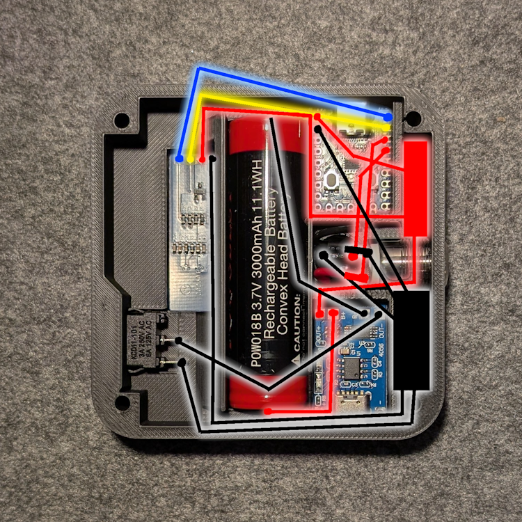

# GymBuddy

GymBuddy is a minimalist, distraction-free timer for your gym sessions. It helps you track your training and break times without relying on your smartphone or other devices.

---

## Important Links
- 3D files on Makerworld: [Gym Buddy Makerworld](https://makerworld.com/de/models/795806#profileId-734935)

## Features

- **Distraction-Free**: Avoid the temptation of checking your phone during workouts.
- **Time Display**: Shows elapsed time in the format **HH:MM:SS** once powered on.
- **Break Timer**: Press the button to start a secondary timer for breaks.
- **60-Second Alert**: The buzzer sounds when the break timer reaches 60 seconds, indicating the end of your break.
- **Pause Timer Control**: Press the button again to stop the break timer and silence the buzzer.

---

## Bill of Materials (BoM)

| **Component**                        | **Description**                                    | **Link**                                                                                                    |
|--------------------------------------|----------------------------------------------------|------------------------------------------------------------------------------------------------------------|
| **Toggle Switch**                    | On/Off switch for the device                      | [Link](https://www.amazon.de/dp/B0CSJTHZHR?ref=ppx_yo2ov_dt_b_fed_asin_title&th=1)                         |
| **I2C OLED Display (128x32)**        | Display for timers (compatible with 3.3V - 5V)    | [Link](https://www.amazon.de/dp/B07BDFXFRK?ref=ppx_yo2ov_dt_b_fed_asin_title)                              |
| **Push Button (12mm, 12V)**          | Button to start/stop the break timer              | [Link](https://www.amazon.de/dp/B0B3Q546VC?ref=ppx_yo2ov_dt_b_fed_asin_title&th=1)                         |
| **USB-C 18650 Charger Module**       | Power supply module with battery support          | [Link](https://www.amazon.de/dp/B09WMVLWH5?ref=ppx_yo2ov_dt_b_fed_asin_title&th=1)                         |
| **18650 Battery**                    | Rechargeable battery for power                    | [Link](https://www.amazon.de/dp/B0BXX48HGJ?ref=ppx_yo2ov_dt_b_fed_asin_title)                              |
| **RP2040-Zero MCU Board**            | Microcontroller based on Raspberry Pi RP2040      | [Link](https://www.amazon.de/dp/B0B2Z3YWB9?ref=ppx_yo2ov_dt_b_fed_asin_title)                              |
| **3V Buzzer Module**                 | Buzzer for alerts                                 | [Link](https://www.amazon.de/dp/B0BGPPVJZG?ref=ppx_yo2ov_dt_b_fed_asin_title&th=1)                         |
| **M3.5 Self-Tapping Screws**         | Screws for securing components                    | [Link](https://www.amazon.de/dp/B0CNCSQJ7H?ref=ppx_yo2ov_dt_b_fed_asin_title)                              |
| **Cables**                           | For wiring connections                            | -                                                                                                          |

---

### BoM Picture

---

## Preparing the RP2040

### Step 1: Flash CircuitPython onto the RP2040

1. **Download the CircuitPython firmware**:
   - Visit [CircuitPython.org](https://circuitpython.org/board/raspberry_pi_pico/) and download the `.uf2` file for the RP2040 (make sure to match your board's model).

2. **Enter Bootloader Mode**:
   - Connect the RP2040 to your computer via USB while holding down the **BOOTSEL** button.
   - A new drive named `RPI-RP2` should appear on your computer.

3. **Flash CircuitPython**:
   - Copy the downloaded `.uf2` file onto the `RPI-RP2` drive.
   - The RP2040 will restart, and a new drive named `CIRCUITPY` should appear. This confirms CircuitPython is now running on the board.

---

### Step 2: Prepare the RP2040 for the Code

1. **Download and Install Thonny**:
   - Download [Thonny IDE](https://thonny.org/).
   - Install Thonny and launch the application.

2. **Set up Thonny for CircuitPython**:
   - Go to **Tools > Options > Interpreter**.
   - Set the Interpreter to **CircuitPython (Raspberry Pi Pico)**.
   - Select the correct COM port for your RP2040 if not detected automatically.

3. **Setup Required Libraries**:
   - Copy the files from the `lib` folder of this project to the `lib` folder on your `CIRCUITPY` drive
   - Your `CIRCUITPY` drive should now have a `lib` folder with these libraries.

4. **Copy the Code**:
   - Save the GymBuddy code as `code.py` and place it in the root directory of your `CIRCUITPY` drive.

5. **Restart the RP2040**:
   - Eject the `CIRCUITPY` drive safely from your computer.
   - Unplug and replug the RP2040, or press the reset button.
   - The code will automatically run, and you should see the timer on the OLED display.

---

## Wiring Diagram

The following diagram shows the wiring connections for the components. Ensure all connections are secure before powering on the device.

---

With GymBuddy, you can fully focus on your workouts without distractions. Enjoy building it and have fun training! 💪
